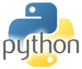
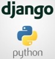
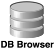
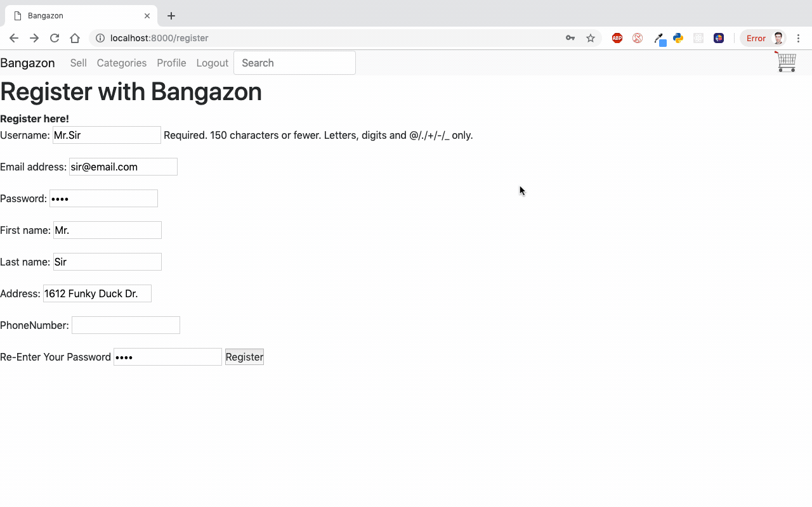
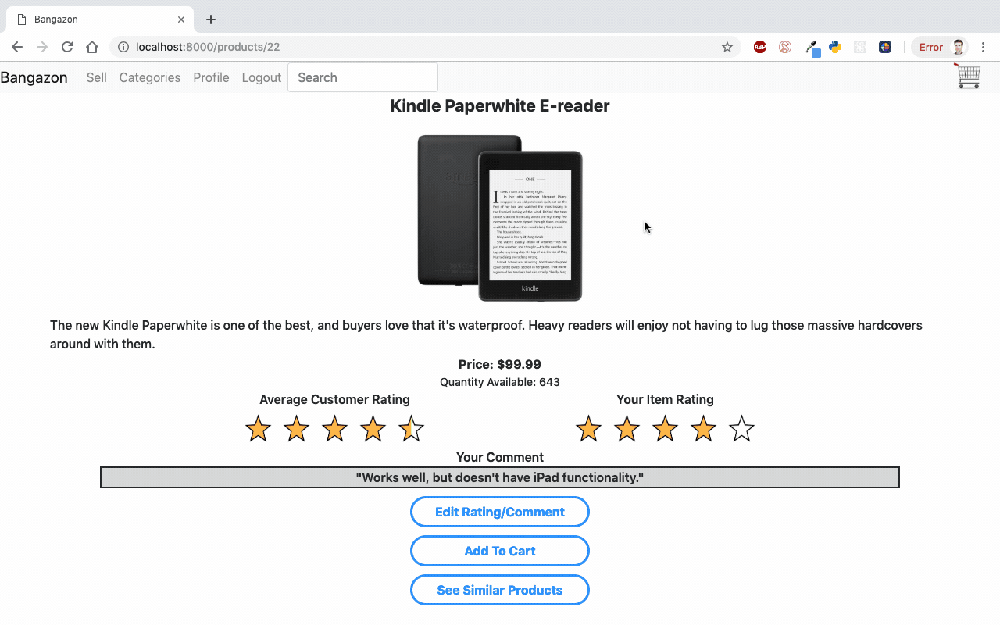
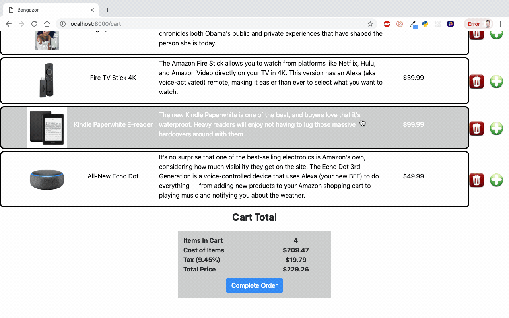
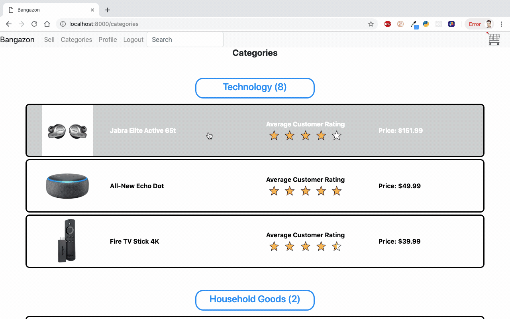
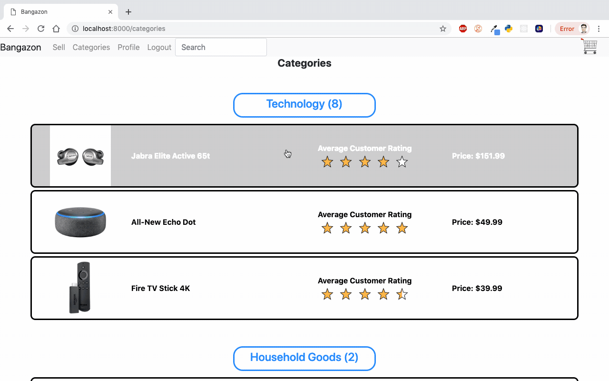

# Welcome to Bangazon
<div style="text-align:center">
<h1 style="font-weight: bold">Bangazon</h1>

</div>

<h2 style="font-weight: bold">E-commerce Site</h2>

<h3>This a a client facing Bangazon e-commerce website. After registering users can browse through
products other users have posted. They can also add items of their own to sell. Items can be view by
category, or searched by keyword.</h3>

<h2 style="font-weight: bold;"> Technologies Used
<h3>Development Languages and Libraries</h3>

________________________

<h1></h1>
<h3>Development Tools</h3>

__________________

## To see a visual walkthrough of main features navigate to the bottom of this readme or:

<h2>Instructions for Installing Bangazon</h2>

<h4> You will need to have command line tools installed for your computer to use terminal commands.
</h4>

  * Mac users - Open your terminal and type

    ```sh
    git --version
    ```

  * Linux/Windows users, please vist the [Git page](https://git-scm.com/book/en/v2/Getting-Started-Installing-Git) and follow the instructions for setup

<h4>You will now need to configure your git account. In the terminal window, type</h4>

  ```sh
  git config –global user.name “You Name”
  git config –global user.email “Your Email”
  ```

#### Create a new directory to store the files in. Type this into your terminal window.

  ```sh
  mkdir Bangazon
  cd Bangazon
  git clone https://github.com/garrulous-gobies/Bangazon-sprint-2
  ```

#### If you do not have Python version 3 installed on your machine, visit the [Python Download Page](https://www.python.org/downloads/) or to install with command line,

```sh
/usr/bin/ruby -e "$(curl -fsSL https://raw.githubusercontent.com/Homebrew/install/master/install)"
brew install python
```


#### Now you need to install all dependencies. We recommend using a virtual environment to prevent these from being installed globally.

#### First install virtualenv and create and enter a virtual environment, in the containing "Bangazon" folder:
```sh
pip install --user virtualenv
virtualenv myenv
source myenv/bin/activate
```
#### To install dependencies navigate to the cloned repository which contains a 'requirements.txt' file then run pip install requirements.txt

```sh
cd Bangazon_1
pip install requirements.txt
```

#### Create and seed the database by changing the permissions on this shell script and executing it with the following commands:

```sh
chmod +x django_data.sh
./django_data.sh website buildDb.py
```


#### You can now run the program by typing(You must be in the directory that contains the 'manage.py' file):

```sh
python manage.py runserver 8080
```
 #### navigate to localhost:8080 to access the website

<h1 style="text-align:center; font-weight: bold;">Congratulations! You are now experiencing Bangazon!

<h2 style="text-align: center">Entity Relationship Diagrams</h2>


<h2 style="text-align: center; font-weight: bold"> Visual Feature List</h2>

<h3 style="text-align: center">Here is a visualization of the primary features and behaviors of the application to get you started.</h3>

## Registering a new account and browsing items


### Adding items to your "cart"


### Check out and complete your order with a new payment method


### Search through all products by keyword in item title or description


### Edit your user details and view your order history.


### Post a new item to sell on the marketplace.



